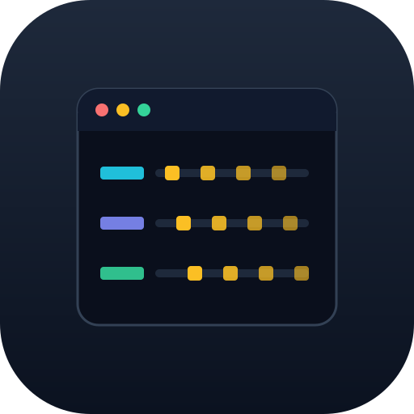

<h1 align="center">
  <br>
  TrafficDeck
</h1>

<p align="center">
  Capture traffic from a browser, a phone or a proxy — decode it, store it, and read it
  in a mitmproxy-like terminal UI.
</p>

TrafficDeck captures raw packets (or already-decoded flows) from several sources, decodes
them **server-side and in-process in Go** — TCP/QUIC reassembly, TLS decryption from a
key-log, HTTP/1.1, HTTP/2, HTTP/3, WebSocket — and serves them to a TUI, to agents over
MCP, or to your own client over gRPC. Storage is embedded SQLite: one self-contained
bundle per session. No database server, no Docker, no proxy or CA in the way of the
traffic unless you want one.

## Features

- **Protocols** — HTTP/1.1, HTTP/2, HTTP/3 + QUIC, WebSocket, and custom binary protocols
  over TLS ([compiled-in Go decoders](docs/decoders.md); first decoder: **MAX** /
  `ru.oneme`).
- **Fingerprinting** — what a client's stack looks like on the wire, from the raw frames:
  **JA3/JA4** with a [**named client**](docs/fingerprints.md) (`Chrome 150`,
  `OkHttp (Android)`, …) from a registry you can extend without a rebuild, the verbatim
  TLS ClientHello bytes (exportable, incl. the one after a HelloRetryRequest), and the
  Akamai **HTTP/2 fingerprint** (client SETTINGS, WINDOW_UPDATE, PRIORITY, pseudo-header
  order). Compare A/B diffs two requests' header/pseudo-header/cookie order across
  sessions.
- **Capture sources** — [live Chrome](docs/capture-sources.md#b-live-capture-chrome)
  (`dumpcap` + `SSLKEYLOGFILE`),
  [mitmproxy](docs/capture-sources.md#c-mitmproxy-any-device-incl-wireguard) (any device,
  incl. WireGuard), [per-app Android](docs/capture-sources.md#d-android-rooted-emulatordevice-per-app)
  from a rooted device/emulator (Frida `libssl` key-log + UID→NFLOG `tcpdump`), and
  [pcap import](docs/capture-sources.md#a-import-a-pre-captured-pcap--keylog).
- **Live decode** — a streaming capture decodes as it arrives, no tshark, and the flows
  are persisted incrementally, so a running capture is fully readable mid-flight.
- **HTTP/2 connections** — a flow records the connection it rode on and its stream within
  it, so multiplexed requests can be grouped back onto one connection.
- **Proxy tunnels** — connections through an HTTP `CONNECT` or SOCKS4/4a/5 proxy are
  decoded *through* the handshake, keeping the real target as the authority, and each flow
  is flagged with the proxy it rode — address, type, and any credentials seen on the wire.
- **TUI** — session list → flow table → detail, body pretty-printing, cross-session
  compare, curl/raw export, annotations (tags, favorites, comments, color marks, groups),
  and a jump straight into Wireshark on the packets behind a request.
- **Server-side filtering** — a [mitmproxy-style filter DSL](docs/filters.md) evaluated in
  the gateway, including header and body terms, so the viewer holds a page rather than a
  session and a 273k-flow capture opens instantly.
- **MCP** — [`trafficdeck-mcp`](docs/mcp.md) exposes recorded sessions to LLM/agent
  clients over the same read API.
- **Sessions** — self-contained per-session SQLite bundles;
  [export/import](docs/sessions.md) as a single `.tar.gz`.

## Install

Needs [**mise**](https://mise.jdx.dev) (provisions go, python, uv, buf) and the
**Wireshark CLI** (`dumpcap` for live capture, `tshark` for pcap import — the default live
decode needs neither).

```sh
git clone <this repo> traffic-deck && cd traffic-deck
mise install
make build
```

For live capture you also need permission to capture packets: on Linux join the
`wireshark` group (`sudo usermod -aG wireshark $USER`, then re-login); on macOS install
Wireshark's ChmodBPF helper.

## Quick start

```sh
./trafficdeck
```

That runs the gateway in-process and the TUI in the foreground. The gateway supervises
capture, so there is no second terminal: press **`a`** on the sessions screen to start a
capture (pick a source, step through its options), **`s`** to stop it. `↑/↓`+`Enter` drills
in, `Esc` goes back, `q` quits — and quitting shuts the gateway down cleanly.

To run them apart (headless gateway, remote or multiple viewers):

```sh
make run       # gateway only
tui/run.sh     # the TUI, GATEWAY_ADDR overridable
```

## Documentation

| | |
|---|---|
| [Capture sources](docs/capture-sources.md) | pcap import, Chrome, mitmproxy, Android — flags and prerequisites |
| [The TUI](docs/tui.md) | keys by screen, the windowed flow table, HTTP/2 columns, Wireshark |
| [Filter syntax](docs/filters.md) | the filter DSL: terms, cost, RE2 |
| [MCP server](docs/mcp.md) | tools, paging, running it |
| [Configuration](docs/configuration.md) | every environment variable |
| [Custom decoders](docs/decoders.md) | decoding a non-HTTP binary protocol |
| [Sharing sessions](docs/sessions.md) | export/import a session bundle |
| [TLS fingerprint names](docs/fingerprints.md) | naming clients from JA3/JA4 |
| [Third-party modules](docs/modules.md) | plugging in your own capture source or viewer |
| [Architecture](docs/architecture.md) · [ADRs](docs/adr/) | how it fits together, and why |

## Components

| Dir | What |
|-----|------|
| [`proto/`](proto/) | gRPC contract (source of truth) |
| [`gateway/`](gateway/) | Go service: ingest, decode, filter, per-session SQLite store, serve |
| [`capture/`](capture/) | Independent Python capture apps over a shared `capture_sdk` |
| [`tui/`](tui/) | Textual TUI |
| [`mcp/`](mcp/) | MCP server exposing recorded sessions to LLM/agent clients |

The generated gRPC stubs are committed, so a clone builds without codegen; run
`mise run gen` after editing `proto/`.
