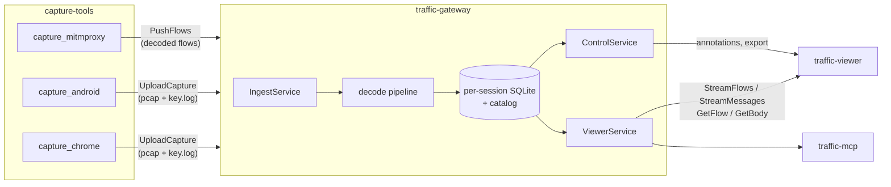
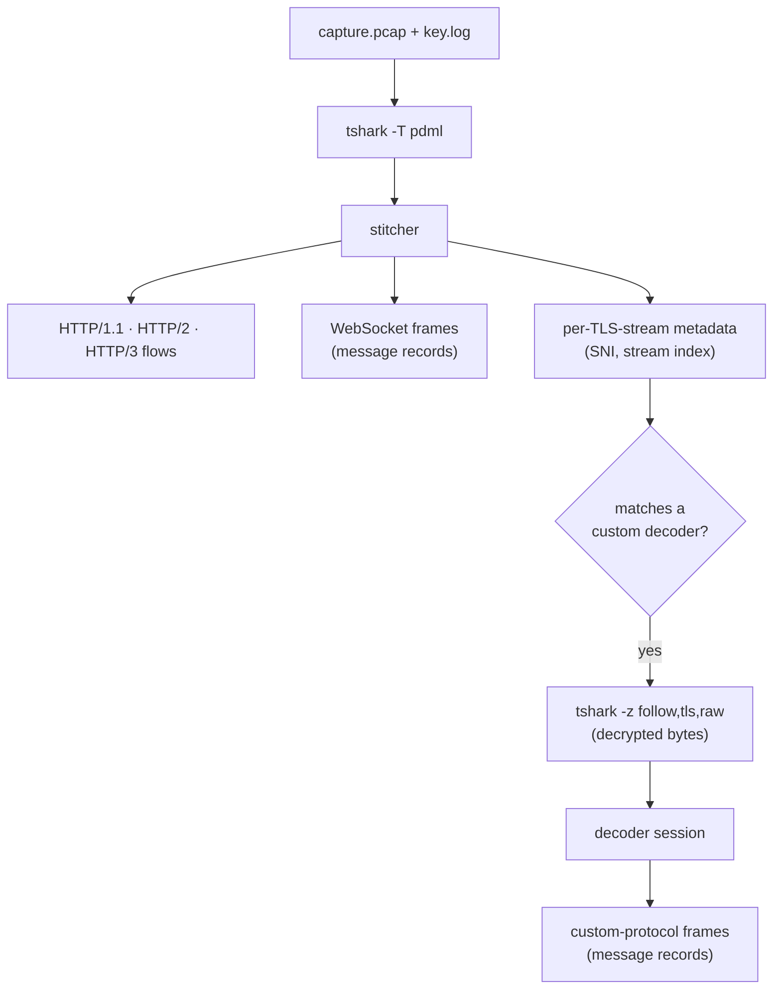
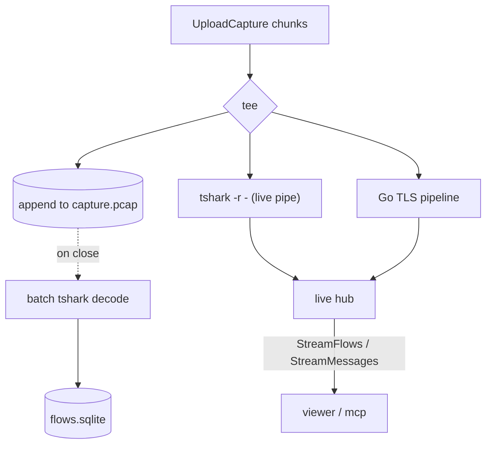
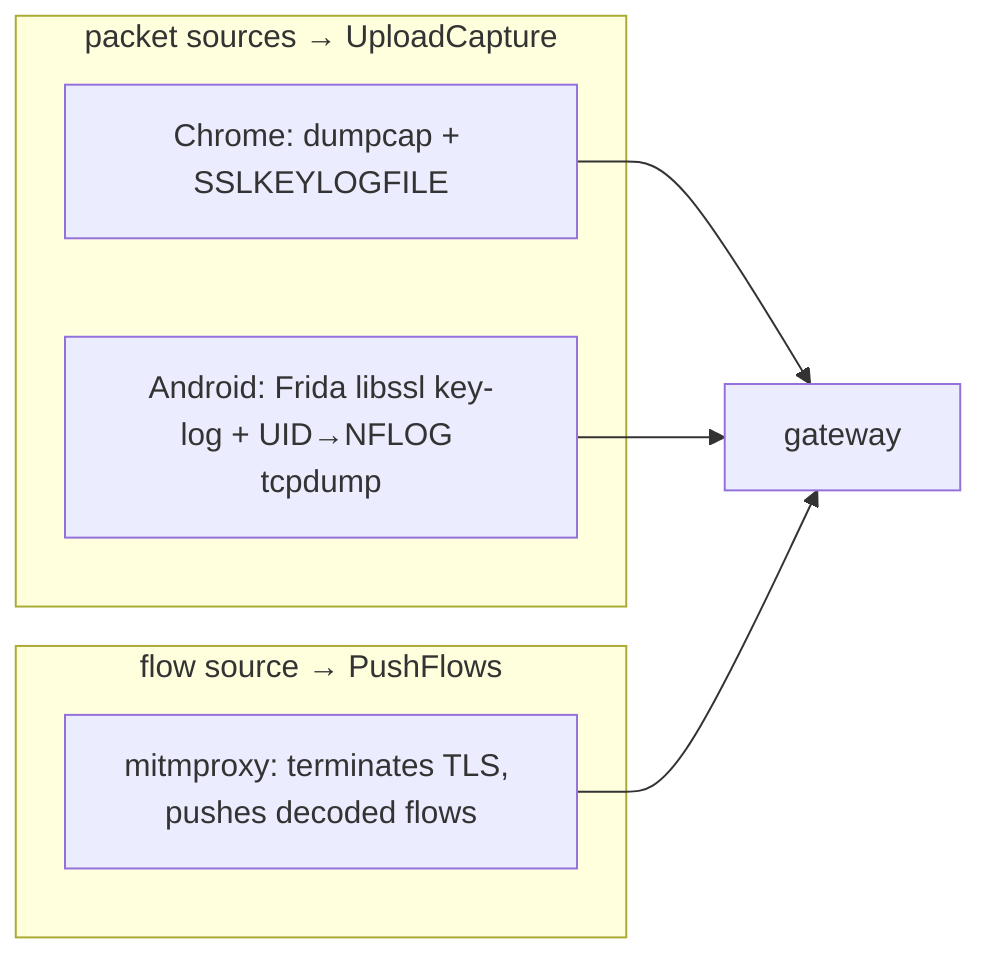

# Architecture

A modular traffic-analysis system for reverse-engineering and parser fingerprinting:
capture an app's traffic, decode it (HTTP/1.1, HTTP/2, HTTP/3, WebSocket, and custom
binary protocols), and browse the decoded flows in a TUI or via an LLM/agent (MCP).

## Components

| Module | Language | Role |
|--------|----------|------|
| `proto/` | protobuf | gRPC contract (source of truth), generated for Go + Python via `buf` |
| `traffic-gateway/` | Go | ingest, decode, store, serve |
| `capture-tools/` | Python | capture apps (`capture_chrome`, `capture_mitmproxy`, `capture_android`) over a shared `capture_sdk` |
| `traffic-viewer/` | Python (Textual) | terminal UI over the gateway's read API |
| `traffic-mcp/` | Python (FastMCP) | Model Context Protocol server over the same read API |



## Storage layout

The gateway has no database server: each session is a self-contained bundle, and a
small global catalog lists them.

```
data/
  catalog.sqlite                 # session list + tag/group definitions
  sessions/<id>/
    capture.pcap                 # raw capture (packet sources)
    key.log                      # TLS secrets (NSS key-log)
    flows.sqlite                 # decoded flows, headers, ws/custom messages, annotations
    blobs/<sha256>               # bodies/payloads too large to inline
```

A bundle is portable on its own (tag/group definitions are mirrored into it), which is
what makes session export/import a single `.tar.gz` (catalog row + the bundle files).
See [ADR-0001](adr/0001-embedded-per-session-sqlite.md).

## Decode pipeline

The gateway shells out to `tshark` for the heavy lifting (TCP reassembly, TLS
decryption, HPACK/QPACK) — see [ADR-0002](adr/0002-tshark-for-dissection.md) — parses
its per-frame PDML, and stitches frames into flows. Custom non-HTTP protocols are
decoded by compiled-in Go modules.



- One PDML `<proto>` element becomes one stitcher record, so multiplexed HTTP/2 frames
  in a single packet keep their own stream id. See
  [ADR-0003](adr/0003-per-frame-pdml-decode.md).
- HTTP request/response pairs become `Flow`s; WebSocket and custom-protocol frames
  become **message records** bound to their flow, rendered as one directional timeline.
  See [ADR-0005](adr/0005-message-shaped-records.md).
- Custom decoders are compiled-in Go modules that self-register; each is a stateful
  framer fed the connection's decrypted byte stream. See
  [ADR-0004](adr/0004-compiled-in-go-decoders.md).

## Live vs. batch decode

A streaming capture is decoded **live** so flows appear while the user browses; on
close an authoritative **batch** pass re-decodes the finalized capture. The live
pipeline is toggleable (`GATEWAY_LIVE_DECODE`); when off, captures are archived and
decoded only on close.



- HTTP/1.1, HTTP/2, HTTP/3 and WebSocket decode live through a single long-lived
  `tshark -r -` reading the streamed capture.
- Custom raw-TCP protocols decode live **in-process in Go**: the gateway reassembles
  TCP (`gopacket`, incl. the Android NFLOG link type) and decrypts TLS 1.3 from the
  key-log itself, with no `tshark` re-run. See
  [ADR-0006](adr/0006-in-process-tls-decryption.md).
- Persistence is authoritative on close; the live path is for responsiveness.

## Capture sources



- **Chrome** and **Android** are *packet* sources: they stream a pcap + a TLS key-log,
  and the gateway decodes. Android captures one app's traffic from a rooted
  device/emulator (Frida hooks the system `libssl` for the key-log; the app's packets
  are isolated by UID). See [ADR-0007](adr/0007-android-per-app-capture.md).
- **mitmproxy** is a *flow* source: it terminates TLS and pushes already-decoded flows,
  so no pcap/key-log is involved.

## Capture-tools structure

Each capture tool is an independent app with isolated dependencies (installing the
Chrome tool pulls neither `mitmproxy` nor `frida`), sharing a light `capture_sdk`. See
[ADR-0008](adr/0008-independent-capture-apps.md).

## Architecture decisions

The decisions above are recorded as ADRs in [`docs/adr/`](adr/).
